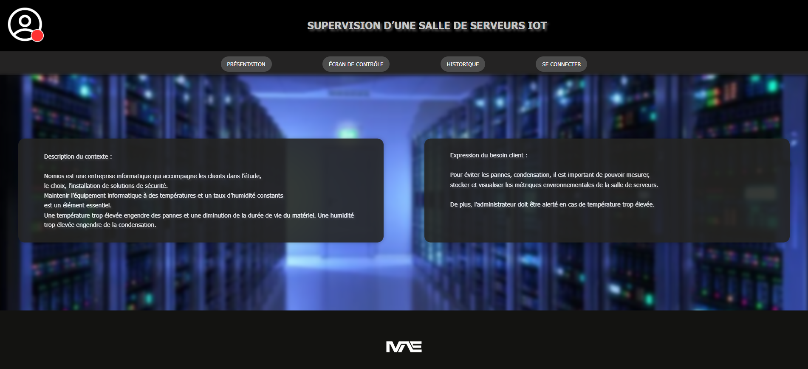

# Supervision_Sallle_de_Serveur - Interface Web

## Description

Le projet "Supervision d'une salle de Serveur (IoT)" est un mini-projet de développement web qui permet de tester les connaissances en développement web à travers des questions dynamiques. Ce projet est réalisé en **JavaScript** et **PHP**, et il a pour objectif de renforcer les compétences en développement, notamment dans les domaines du **front-end**. 

Les questions abordent des sujets fondamentaux du développement web tels que  **JavaScript**, **HTML** et **CSS**, et permettent de valider des connaissances de base et d'approfondir les pratiques de programmation.

## Extrait du projet

<div style="text-align: center;">
  
</div>


## Fonctionnalités

- **Interface web** : L'interface est conçue pour être simple et compréhensible pour tous, permettant aux utilisateurs de comprendre d'un coup d'oeil les données relatifs aux éléments IoT.
- **Gestion des comptes** : L'administrateur est en capacité d'ajouté un compte avec un nom d'utilisateur et un mot de passe associé, de plus les permissions qu'il détiendras.
- **Gérer les seuils** : L'application permet de se connecter en compte administrateur pour régler les seuil d'alerte afin de garder la salle de serveurs dans un état convenable.

## Technologies utilisées

- **Chart.js** : Ce projet met en commun une **Bibliothéque Javascript**, et un capteur DHT11 qui récupere des données comme la température et l'humidité de la salle ou il est placé.
- **JavaScript** : Utilisé pour l'interactivité côté client, y compris la gestion des seuils d'alerte côté administrateur.
- **HTML/CSS** : Structure du contenu et mise en page de l'interface web.

## Objectifs

Ce projet vise à renforcer mes compétences en développement web, en particulier **JavaScript**, tout en me permettant de réaliser un projet complet, dynamique et interactif. L'objectif est de pratiquer les fondamentaux du développement web et de perfectionner mes capacités à créer des applications autour d'un projet de groupe.

## Installation

1. Clonez ce dépôt sur votre machine locale :
   ```bash
   git clone https://github.com/enzo-mensier/Supervision_Salle_de_Serveur.git